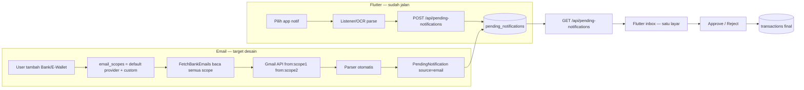

# Unified Pending Inbox — Email Scope Fleksibel (seperti Pilih App di Flutter)

## Visi yang Anda inginkan

Paralel dengan Flutter (pilih app → notif masuk → pending → approve):



**Prinsip:** OCR, push notif, dan email **satu inbox**, **satu tabel staging**, **satu approve flow**. Flutter tidak perlu polling endpoint kedua.

---

## Masalah arsitektur saat ini

| Aspek | Sekarang | Yang Anda inginkan |
|---|---|---|
| Staging email | `transactions` (`is_pending=true`) | `pending_notifications` |
| Flutter inbox | Hanya baca `pending-notifications` | Email ikut muncul di sini |
| Scope per bank | `email_scopes` sudah ada, tapi label membingungkan | Default provider + user bisa override |
| Default sender | Duplikat di JS + `GmailService::$senderEmails` | Satu registry di backend |
| Approve email | Route terpisah `pending-transactions/*` | Sama dengan OCR/push |

Enum `source` di [`pending_notifications`](database/migrations/2026_06_23_035231_create_pending_notifications_table.php) saat ini hanya `push_notif | ocr` — perlu ditambah `email`.

---

## Desain: Email Scope per Akun (mirror "pilih app")

### Konsep

Setiap akun bank/e-wallet punya **`email_scopes`** (JSON array): daftar **alamat pengirim** (bukan inbox Gmail user).

| Langkah user | Perilaku sistem |
|---|---|
| Tambah akun DANA | Backend auto-isi scope default dari registry (`no-reply@dana.id`) |
| Provider ganti alamat email | User edit/tambah email custom di scope akun itu |
| Tambah bank BCA | Scope default BCA terpisah — hanya email BCA yang di-fetch untuk akun itu |
| Fetch Gmail | Union semua scope dari akun non-cash user → query Gmail `{from:a from:b ...}` |

Ini analogi langsung dengan Flutter: **pilih app** = **pilih bank + pengirim email**; yang tidak dipilih tidak difetch.

### Satu sumber kebenaran — `EmailProviderRegistry`

File baru mis. [`config/email_providers.php`](config/email_providers.php) atau [`app/Services/EmailProviderRegistry.php`](app/Services/EmailProviderRegistry.php):

```php
// contoh struktur
'dana'  => ['senders' => ['no-reply@dana.id'],  'parser' => DanaParser::class],
'gopay' => ['senders' => ['notification@gopay.co.id'], ...],
'bca'   => ['senders' => ['info@bca.co.id', 'bca@notify.bca.co.id'], ...],
```

Digunakan oleh:
- Auto-fill saat `POST/PUT /api/accounts` dan [`WebCrudController::storeDompet`](app/Http/Controllers/WebCrudController.php) jika `email_scopes` kosong
- [`GmailService`](app/Services/GmailService.php) — ganti hardcoded `$senderEmails`
- UI web [`dompet-digital/index.blade.php`](resources/views/app/dompet-digital/index.blade.php) — `fillDefaultScopes()` panggil API atau inline dari config yang sama
- (Opsional) `GET /api/email-providers/{provider}/default-scopes` untuk Flutter dompet screen

### Validasi scope

- Normalisasi ke lowercase
- **Tolak atau warning** jika scope = email OAuth user (inbox Gmail terhubung) — ini penyebab bug Anda sebelumnya
- Scope kosong pada akun non-cash → auto-fill default dari provider saat simpan

---

## Desain: Alur Fetch → Parse → Pending

### 1. Fetch ([`FetchBankEmails`](app/Jobs/FetchBankEmails.php))

```
Precondition: email_fetch_enabled + OAuth token valid

scopes = accounts(non-cash)
           .flatMap(email_scopes)
           .unique()

if scopes empty → log warning, skip (user belum setup bank)

messages = GmailService.fetchNewEmails(token, scopes)

foreach message:
  content = fetchMessageContent(gmailMessageId)
  parsed  = EmailParserService.parseEmail(from, subject, body, userId)
  if parsed:
    EmailParserService.saveAsPendingNotification(parsed, userId, gmailMessageId, rawBody, from)
```

**Perbaikan scope:** hanya kumpulkan sender dari `email_scopes` akun — **bukan** Gmail pribadi user.

### 2. Parse ([`EmailParserService`](app/Services/EmailParserService.php))

Tetap pakai parser pattern yang ada (`BcaParser`, `DanaParser`, dll.).

Matching akun (suggested account saat approve):
1. `extractEmail(from)` → `whereJsonContains('email_scopes', bareEmail)`
2. Fallback: `where('provider', $parsed->provider)` (case-insensitive)

### 3. Simpan ke pending (GANTI `processParsedTransaction`)

Method baru: `saveAsPendingNotification()` → insert ke `pending_notifications`:

| Kolom | Nilai |
|---|---|
| `type` | dari parser |
| `amount` | dari parser |
| `description` / `merchant` | dari parser |
| `notification_date` | dari parser |
| `raw_body` | isi email (untuk debug/user review) |
| `source` | **`email`** |
| `status` | `pending` |
| `email_message_id` | Gmail message ID (unique, dedup) |
| `account_id` | akun suggested (nullable, pre-select di UI approve) |

**Dedup:** cek `email_message_id` sebelum insert — ganti md5 buatan parser.

**Deprecate:** `processParsedTransaction()` yang menulis ke `transactions is_pending` — hapus setelah migrasi.

### 4. Approve / Reject (satu flow)

Pakai [`PendingNotificationController`](app/Http/Controllers/Api/PendingNotificationController.php) yang sudah ada:

- **Approve:** user pilih `category_id` + `account_id` (pre-fill dari `account_id` suggested jika ada) → `TransactionService::createTransaction(is_pending=false)` → `status=confirmed`
- **Reject:** `status=rejected` (konsisten web & API — tidak lagi set `pending_source=rejected` di transactions)

Extend validasi `store()` — tetap hanya `push_notif|ocr` dari Flutter; email hanya dari backend job.

Web [`notifikasi/index.blade.php`](resources/views/app/notifikasi/index.blade.php):
- Hapus section terpisah "Transaksi Email Tertunda"
- Satu list dengan badge: `Notif HP` | `OCR` | `Email`
- Hapus route `transaksi.pending.*` yang redundant

Flutter: **tanpa perubahan endpoint** jika `source=email` sudah di enum — cukup tambah badge/icon di UI.

---

## Migration database

```sql
-- 1. Extend enum source
ALTER ... source ENUM('push_notif','ocr','email')

-- 2. Kolom baru di pending_notifications
email_message_id VARCHAR(255) UNIQUE NULLABLE
account_id       FK accounts NULLABLE  -- suggested account

-- 3. (Opsional) Migrasi data lama
INSERT pending_notifications (...) 
SELECT ... FROM transactions 
WHERE is_pending=1 AND source='email'

-- 4. Hapus transaksi pending email lama setelah migrasi
DELETE FROM transactions WHERE is_pending=1 AND source='email'
```

Route API [`pending-transactions/*`](routes/api.php) bisa di-deprecate atau dipertahankan sementara return empty + header deprecation.

---

## Perbandingan dengan command test

| | `test:email-parser --save` (sekarang) | Setelah refactor |
|---|---|---|
| Input | Sample hardcoded | Gmail API / sample |
| Output | `transactions` pending | `pending_notifications` source=email |
| Muncul di Flutter | Tidak | **Ya** (endpoint yang sama) |
| Dedup | md5 lemah | Gmail message_id |

Update [`TestEmailParser`](app/Console/Commands/TestEmailParser.php) agar `--save` memanggil `saveAsPendingNotification()`.

---

## Urutan implementasi

### Fase 1 — Foundation
1. `EmailProviderRegistry` + refactor `GmailService` pakai registry
2. Auto-fill `email_scopes` on account create/update jika kosong
3. Validasi: scope != OAuth inbox email

### Fase 2 — Unified pending
4. Migration `pending_notifications` (+ source email, email_message_id, account_id)
5. `saveAsPendingNotification()` + update `FetchBankEmails`
6. Update `TestEmailParser --save`
7. Extend `PendingNotificationController` approve: pre-fill account dari suggested

### Fase 3 — UI & cleanup
8. Satukan halaman web notifikasi (satu list, badge Email)
9. Hapus/deprecate `pending-transactions` routes + web pending transaction handlers
10. Perjelas label dompet: *"Email pengirim notifikasi (bukan Gmail Anda)"*
11. (Opsional) API default scopes untuk Flutter dompet screen

### Fase 4 — Verifikasi
12. Test: tambah akun DANA → default scope → fetch manual → muncul di `GET /api/pending-notifications`
13. Test: tambah email custom di scope → fetch hanya sender tersebut
14. Test: approve/reject email via Flutter (endpoint yang sudah ada)

---

## File utama yang akan disentuh

- **Baru:** `config/email_providers.php` atau `app/Services/EmailProviderRegistry.php`
- [`app/Services/EmailParserService.php`](app/Services/EmailParserService.php) — `saveAsPendingNotification()`, extractEmail fix
- [`app/Jobs/FetchBankEmails.php`](app/Jobs/FetchBankEmails.php) — scope aggregation, panggil method baru
- [`app/Services/GmailService.php`](app/Services/GmailService.php) — pakai registry
- [`app/Http/Controllers/Api/PendingNotificationController.php`](app/Http/Controllers/Api/PendingNotificationController.php) — approve dengan suggested account
- [`app/Http/Controllers/WebPageController.php`](app/Http/Controllers/WebPageController.php) — notifikasi single list, hapus pending transaction handlers
- [`resources/views/app/notifikasi/index.blade.php`](resources/views/app/notifikasi/index.blade.php) — badge Email, hapus section bawah
- [`resources/views/app/dompet-digital/index.blade.php`](resources/views/app/dompet-digital/index.blade.php) — label + default scopes dari backend
- Migration baru untuk `pending_notifications`
- [`routes/api.php`](routes/api.php) — deprecate `pending-transactions` (opsional fase 3)
- [`app/Console/Commands/TestEmailParser.php`](app/Console/Commands/TestEmailParser.php)

**Flutter:** perubahan minimal — tampilkan badge `source == 'email'`; pre-select `account_id` jika API mengembalikan field tersebut.

---

## Catatan penting untuk Anda

- **Email scope = alamat pengirim bank**, bukan Gmail pribadi Anda. Inbox Gmail (OAuth) adalah *tempat membaca*; scope adalah *siapa pengirim* yang boleh difetch.
- Fitur fleksibel yang Anda mau **sudah 80% ada** (`email_scopes` per akun + default di UI) — yang perlu diperbaiki adalah **(1) satukan output ke `pending_notifications`** dan **(2) centralize default provider + validasi scope**.
